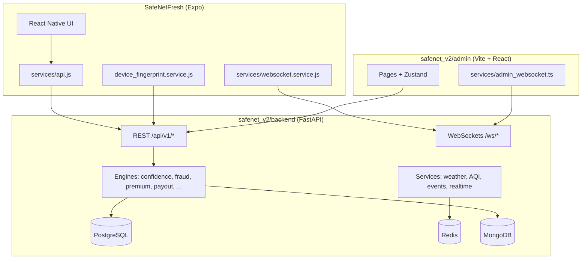

# 🛡️ SafeNet — AI Income Protection for Gig Workers

> **Guidewire DevTrails 2026 — Phase 2 (Scale)** | Team AlphaNexus  
> *"SafeNet doesn't ask you to prove anything. It proves it for you."*

---

## 🚀 Try It Now — Everything is Live

| | URL | Notes |
|--|--|--|
| 📱 **Worker App** | **[https://safenet-sage.vercel.app](https://safenet-sage.vercel.app)** | Open on any phone browser |
| 🖥️ **Admin Dashboard** | **[https://safenet-admin-wine.vercel.app](https://safenet-admin-wine.vercel.app)** | Login: `admin` / `admin123` |
| ⚙️ **Backend API** | [https://safenet-api-y4se.onrender.com](https://safenet-api-y4se.onrender.com) | FastAPI on Render |
| ❤️ **Health Check** | [https://safenet-api-y4se.onrender.com/health](https://safenet-api-y4se.onrender.com/health) | Should return `{"status":"ok"}` |
| 🎬 **Demo Video** | [Watch on YouTube](https://youtube.com/shorts/KdsrN05xIyM) | 2-minute walkthrough |
| 💻 **GitHub** | [devtrails-2026-alphanexus-phase2](https://github.com/BHARGAVSAI558/devtrails-2026-alphanexus-phase2) | Full source code |

---

## ⚡ 60-Second Judge Demo

**On your phone — right now:**

1. Open **[https://safenet-sage.vercel.app](https://safenet-sage.vercel.app)**
2. Enter any 10-digit number → OTP appears on screen → enter it
3. Select **Zomato** → **Kukatpally** → **Evening 6–10 PM** → **Standard ₹49/week**
4. Dashboard loads with **live weather**, **real AQI**, and your **Earnings DNA heatmap**
5. Tap **"Simulate Disruption"** → choose **Heavy Rain**
6. Watch: Detected → Verifying → Fraud Check → Decision in real time

**On laptop (same time):**
- Open [https://safenet-admin-wine.vercel.app](https://safenet-admin-wine.vercel.app)
- Login with `admin` / `admin123`
- See the same claim in the **live admin feed**

---

## 📱 Mobile App — 3 Ways to Access

### Option 1 — Browser (fastest, no install)
👉 **[https://safenet-sage.vercel.app](https://safenet-sage.vercel.app)**

### Option 2 — Expo Go
Install Expo Go and scan this QR:


Fallback:
`exp://u.expo.dev/2d45889e-9415-4966-be7f-ba2711a57f13/group/b2d4e11e-ec7a-421f-b60e-75132863e7be`

### Option 3 — Run locally
```bash
git clone https://github.com/BHARGAVSAI558/devtrails-2026-alphanexus-phase2
cd devtrails-2026-alphanexus-phase2/SafeNetFresh
npm install && npm start
```

---

## 🎯 What Makes SafeNet Different

- **Earnings DNA**: personalized hour/day earning fingerprint (not flat payouts)
- **Forecast Shield**: proactive cover upgrades before forecasted risk windows
- **Zero-touch claims**: disruption detect → verify → fraud checks → decision
- **4-layer fraud engine**: GPS integrity, cross-signal checks, cluster/ring checks, enrollment anomalies
- **In-app multilingual assistant**: English, Hindi, Telugu with admin reply loop

---

## 🆕 Recent Product Updates

- Assistant now supports **language switch** (`🌐`) for EN/HI/TE
- Predefined queries return **correct mapped responses** per language
- Only **custom typed support messages** go to admin queue (predefined excluded)
- Earnings DNA simplified to quick snapshot: live status, heatmap, next peak, today potential, week progress
- Demo payouts follow realistic cadence and deterministic amounts
- Admin KPIs include pooled vs paid weekly visibility

---

## 🏗️ System Architecture (Overview)

```text
Worker App (Expo/Web) + Admin (React)
            │ REST + WebSocket
            ▼
     FastAPI Backend (Render)
            │
   PostgreSQL + Redis + External APIs
```

---

## 🛠️ Tech Stack

| Layer | Technology |
|-------|-----------|
| Worker App | React Native, Expo, Expo Web |
| Admin | React, Vite, TypeScript, Tailwind, Recharts |
| Backend | FastAPI, SQLAlchemy, Alembic |
| ML | XGBoost, scikit-learn |
| Real-time | WebSockets, Redis pub/sub |
| Deployment | Render (backend), Vercel (frontend) |

---

## Local development

### Backend API (`safenet_v2/backend`)

```bash
cd safenet_v2/backend
# Configure .env (DATABASE_URL, REDIS_URL, JWT_SECRET, etc.)
python -m uvicorn app.main:app --reload --host 0.0.0.0 --port 8000
```

Use **`--host 0.0.0.0`** so phones, emulators, and other devices on your LAN can reach port **8000**. Health: [http://127.0.0.1:8000/health](http://127.0.0.1:8000/health) or [http://127.0.0.1:8000/](http://127.0.0.1:8000/).

### Mobile app (`SafeNetFresh`)

API base URL is resolved in `SafeNetFresh/services/api.js` from `app.json` → `expo.extra`:

| Key | Purpose |
|-----|---------|
| `BACKEND_URL` | Production API (HTTPS), e.g. Render — used when `BACKEND_URL_DEV` is `remote` or in release builds. |
| `BACKEND_URL_DEV` | `local` — in dev, call `http://<Metro-LAN-host>:8000` (same machine as Expo). `remote` — in dev, always use `BACKEND_URL` (no local uvicorn). |
| `BACKEND_URL_LOCAL` | Optional full URL override (e.g. `http://192.168.1.10:8000`, or an **https** ngrok URL if plain HTTP from the device is blocked). |

Useful scripts (run from `SafeNetFresh/`):

```bash
npm start                 # expo start --lan
npm run verify:api        # quick check that http://127.0.0.1:8000/ responds (uvicorn must be running)
npm run windows:firewall-api   # PowerShell as Administrator: allow inbound TCP 8000 on all Windows firewall profiles (needed for iPhone hotspot → PC)
npm run android:usb-api   # adb reverse tcp:8000 tcp:8000 — then set BACKEND_URL_LOCAL to http://127.0.0.1:8000
```

**Debugging “No response” / timeouts:** On the phone, open Safari (or Chrome) → `http://<YOUR_PC_IP>:8000/`. If the browser cannot load the API, fix Windows firewall + uvicorn binding before changing app code. Expo **tunnel** mode cannot reach your PC’s port 8000 unless you use **HTTPS** (e.g. ngrok) in `BACKEND_URL_LOCAL` or set `BACKEND_URL_DEV` to `remote`.

`app.json` enables **`usesCleartextTraffic`** (Android) and **`NSAppTransportSecurity`** entries (iOS) for dev builds; **Expo Go** still depends on its own native shell for some HTTP rules.

**Web (Expo web):** Run `npx expo start --web` (or press `w` in the Expo CLI). On wide viewports, `SafeNetFresh/components/WebPhoneFrame.js` centers a phone-width column so the worker UI stays app-like. Overlays such as **Pick a disruption**, **Switch plan**, and **Premium due** use `SafeNetFresh/components/AppModal.js` so sheets stay inside that frame instead of spanning the full browser (React Native `Modal` on web often portals to `document.body`). Verification on web uses a single OTP field with `autoComplete="one-time-code"` (SMS autofill works best on supported mobile browsers; desktop usually paste or type).

### Admin dashboard (`safenet_v2/admin`)

```bash
cd safenet_v2/admin
npm install
npm run dev
```

- With **no** `VITE_BACKEND_URL`, Vite proxies `/api` to `http://127.0.0.1:8000` (see `vite.config.js`).
- Or create `.env.local`: `VITE_BACKEND_URL=http://127.0.0.1:8000` (or your deployed API).
- Sign in with **admin** / **admin123** against a running API that exposes `POST /api/v1/auth/admin-login`.

---

## ⚡ Key Features

- **OTP Auth** — phone number login for workers in the mobile app; web build uses a single-field OTP with spacing tuned for readability
- **Admin sign-in** — username/password for the web dashboard (`/auth/admin-login`; default dev credentials documented under Local development)
- **Worker app on web** — centered phone frame on desktop; modals constrained to the frame via `AppModal`
- **Live Zone Status** — weather, AQI, active alerts per zone
- **4-Layer Fraud Engine** — GPS, behavioral, cluster, enrollment checks
- **ML Premium Engine** — dynamic weekly premium based on zone risk + tenure
- **Real-time WebSockets** — claim status updates pushed live to mobile + admin
- **Forecast Shield** — proactive coverage upgrade before predicted disruptions
- **Earnings DNA** — quick earnings snapshot with live demand, next peak window, today potential, and week progress
- **Disruption demo payouts** — `payout_engine.compute_demo_dna_payout` models ₹/hr at risk (capped by tier), with guards so repeated tiny demo runs or quiet IST hours do not produce meaningless ₹4-style credits (see `safenet_v2/backend/app/engines/payout_engine.py`)
- **Support + notifications loop** — floating assistant, support history, admin replies, and notification center (admin-reply focused user alerts)

---

*DevTrails 2026 — AlphaNexus Team*

---

---

# SafeNet (ALPHA workspace) — project map

This repository contains three applications that work together:

| Area | Path | Role |
|------|------|------|
| **API** | `safenet_v2/backend/` | FastAPI backend: auth, policies, claims, fraud/ML engines, WebSockets, schedulers |
| **Admin** | `safenet_v2/admin/` | Vite + React + TypeScript dashboard (username/password admin login, live feed, zones, workers, simulations) |
| **Mobile** | `SafeNetFresh/` | Expo / React Native worker app (dashboard, claims, telemetry) |

---

## High-level architecture



---

## ASCII folder tree (source layout)

> **Note:** `node_modules/`, `.expo/`, `dist/`, `__pycache__/`, and `.venv/` are build/cache folders and are omitted below.

``` 
ALPHA/
├── README.md                          ← this file
├── package-lock.json                  ← root lockfile (if present)
│
├── safenet_v2/
│   ├── backend/
│   │   ├── .env                       ← local secrets (do not commit)
│   │   ├── alembic.ini
│   │   ├── requirements.txt
│   │   ├── alembic/versions/
│   │   │   ├── c002_perf_security_indexes.py
│   │   │   └── c003_device_fingerprints.py
│   │   ├── app/
│   │   │   ├── main.py
│   │   │   ├── __init__.py
│   │   │   ├── api/
│   │   │   │   ├── deps.py
│   │   │   │   └── v1/routes/
│   │   │   │       ├── admin.py
│   │   │   │       ├── auth.py
│   │   │   │       ├── claims.py
│   │   │   │       ├── policies.py
│   │   │   │       ├── simulation.py
│   │   │   │       ├── websockets.py
│   │   │   │       ├── workers.py
│   │   │   │       └── zones.py
│   │   │   ├── core/
│   │   │   │   ├── config.py
│   │   │   │   ├── exceptions.py
│   │   │   │   ├── middleware.py
│   │   │   │   ├── rate_limit.py
│   │   │   │   ├── security.py
│   │   │   │   └── ws_manager.py
│   │   │   ├── data/
│   │   │   │   ├── government_alerts_seed.json
│   │   │   │   └── zone_coordinates.json
│   │   │   ├── db/
│   │   │   │   ├── base.py
│   │   │   │   ├── mongo.py
│   │   │   │   ├── session.py
│   │   │   │   └── migrations/
│   │   │   │       ├── env.py
│   │   │   │       ├── script.py.mako
│   │   │   │       └── versions/
│   │   │   │           ├── c001_baseline.py
│   │   │   │           ├── c002_perf_security_indexes.py
│   │   │   │           └── c003_device_fingerprints.py
│   │   │   ├── engines/
│   │   │   │   ├── behavioral_engine.py
│   │   │   │   ├── confidence_engine.py
│   │   │   │   ├── decision_engine.py
│   │   │   │   ├── fraud_engine.py
│   │   │   │   ├── payout_engine.py
│   │   │   │   ├── premium_engine.py
│   │   │   │   ├── trust_engine.py
│   │   │   │   └── fraud/
│   │   │   │       ├── pipeline.py
│   │   │   │       ├── types.py
│   │   │   │       ├── helpers.py
│   │   │   │       ├── layer1_gps.py
│   │   │   │       ├── layer2_corroboration.py
│   │   │   │       ├── layer3_cluster.py
│   │   │   │       └── layer4_enrollment.py
│   │   │   ├── ml/
│   │   │   │   ├── premium_model.py
│   │   │   │   ├── behavioral_model_trainer.py
│   │   │   │   └── city_baselines.json
│   │   │   ├── ml_models/
│   │   │   │   ├── premium_model.pkl
│   │   │   │   └── feature_importance.png
│   │   │   ├── models/
│   │   │   │   ├── auth_token.py
│   │   │   │   ├── claim.py
│   │   │   │   ├── device_fingerprint.py
│   │   │   │   ├── fraud.py
│   │   │   │   ├── payout.py
│   │   │   │   ├── policy.py
│   │   │   │   ├── pool_balance.py
│   │   │   │   ├── worker.py
│   │   │   │   └── zone.py
│   │   │   ├── schemas/
│   │   │   │   ├── admin.py
│   │   │   │   ├── auth.py
│   │   │   │   ├── claim.py
│   │   │   │   ├── policy.py
│   │   │   │   └── worker.py
│   │   │   ├── services/
│   │   │   │   ├── aqi_service.py
│   │   │   │   ├── cache_service.py
│   │   │   │   ├── cpcb_aqi.py
│   │   │   │   ├── dependencies.py
│   │   │   │   ├── event_service.py
│   │   │   │   ├── notification_service.py
│   │   │   │   ├── otp_service.py
│   │   │   │   ├── protocols.py
│   │   │   │   ├── realtime_service.py
│   │   │   │   ├── signal_types.py
│   │   │   │   ├── weather_service.py
│   │   │   │   └── zone_resolver.py
│   │   │   ├── tasks/
│   │   │   │   ├── background_scheduler.py
│   │   │   │   ├── claim_processor.py
│   │   │   │   └── premium_recalculator.py
│   │   │   └── utils/
│   │   │       ├── crypto.py
│   │   │       ├── geo_utils.py
│   │   │       ├── logger.py
│   │   │       └── validators.py
│   │   ├── scripts/
│   │   │   └── set_admin_user.py
│   │   └── tests/
│   │       └── test_cpcb_aqi.py
│   │
│   └── admin/
│       ├── index.html
│       ├── package.json
│       ├── package-lock.json
│       ├── vite.config.js
│       ├── tsconfig.json
│       ├── tailwind.config.ts
│       ├── postcss.config.js
│       ├── eslint.config.js
│       ├── README.md
│       ├── public/
│       │   ├── favicon.svg
│       │   └── icons.svg
│       └── src/
│           ├── main.tsx
│           ├── App.tsx
│           ├── App.css
│           ├── index.css
│           ├── api.ts
│           ├── components/
│           │   └── Layout.tsx
│           ├── pages/
│           │   ├── Login.tsx
│           │   ├── Dashboard.tsx
│           │   ├── ZoneHeatmap.tsx
│           │   ├── FraudInsights.tsx
│           │   ├── Workers.tsx
│           │   ├── Simulations.tsx
│           │   └── Users.tsx
│           ├── services/
│           │   └── admin_websocket.ts
│           ├── stores/
│           │   ├── auth.ts
│           │   ├── adminConnection.ts
│           │   ├── adminUi.ts
│           │   ├── claimsFeed.ts
│           │   ├── fraudQueue.ts
│           │   ├── poolHealth.ts
│           │   └── zoneEvents.ts
│           └── assets/
│               ├── hero.png
│               ├── react.svg
│               └── vite.svg
│
└── SafeNetFresh/
    ├── App.js
    ├── index.js
    ├── app.json
    ├── babel.config.js
    ├── metro.config.js
    ├── package.json
    ├── package-lock.json
    ├── .gitignore
    ├── assets/
    │   ├── adaptive-icon.png
    │   ├── favicon.png
    │   ├── icon.png
    │   └── splash-icon.png
    ├── components/
    │   ├── AppModal.js
    │   ├── DisruptionModal.js
    │   ├── LocationGate.js
    │   ├── NotificationInitializer.js
    │   ├── PolicyBootstrap.js
    │   ├── PremiumDueModal.js
    │   ├── WebPhoneFrame.js
    │   └── WebSocketBridge.js
    ├── contexts/
    │   ├── AuthContext.js
    │   ├── ClaimContext.js
    │   └── PolicyContext.js
    ├── hooks/
    │   ├── useActiveClaims.js
    │   ├── usePayoutHistory.js
    │   ├── usePoolHealth.js
    │   └── useWorkerProfile.js
    ├── screens/
    │   ├── SplashScreen.js
    │   ├── OnboardingScreen.js
    │   ├── OTPVerifyScreen.js
    │   ├── ProfileSetupScreen.js
    │   ├── DashboardScreen.js
    │   ├── PolicyScreen.js
    │   ├── ClaimsScreen.js
    │   └── ProfileScreen.js
    └── services/
        ├── api.js
        ├── tokenStore.js
        ├── websocket.service.js
        ├── location.service.js
        ├── notification.service.js
        ├── navigationService.js
        └── device_fingerprint.service.js
```

**Cleanup note:** If you see a stray file named `SafeNetFresh/com.facebook.react.modules.core.ReactChoreographer` (no extension), it is not part of the app source; it is safe to delete.

---

## Flat file index (tracked source files)

Alphabetical list of project files **excluding** `node_modules`, `.git`, `__pycache__`, `.expo`, `dist`, and virtualenvs.

### Root

- `package-lock.json`

### `safenet_v2/admin/`

- `eslint.config.js`
- `index.html`
- `package.json`
- `package-lock.json`
- `postcss.config.js`
- `README.md`
- `tailwind.config.ts`
- `tsconfig.json`
- `vite.config.js`
- `public/favicon.svg`
- `public/icons.svg`
- `src/api.ts`
- `src/App.css`
- `src/App.tsx`
- `src/index.css`
- `src/main.tsx`
- `src/assets/hero.png`
- `src/assets/react.svg`
- `src/assets/vite.svg`
- `src/components/Layout.tsx`
- `src/pages/Dashboard.tsx`
- `src/pages/FraudInsights.tsx`
- `src/pages/Login.tsx`
- `src/pages/Simulations.tsx`
- `src/pages/Users.tsx`
- `src/pages/Workers.tsx`
- `src/pages/ZoneHeatmap.tsx`
- `src/services/admin_websocket.ts`
- `src/stores/adminConnection.ts`
- `src/stores/adminUi.ts`
- `src/stores/auth.ts`
- `src/stores/claimsFeed.ts`
- `src/stores/fraudQueue.ts`
- `src/stores/poolHealth.ts`
- `src/stores/zoneEvents.ts`

### `safenet_v2/backend/`

- `.env` *(local only; use your own secrets)*
- `alembic.ini`
- `requirements.txt`
- `alembic/versions/c002_perf_security_indexes.py`
- `alembic/versions/c003_device_fingerprints.py`
- `app/__init__.py`
- `app/main.py`
- `app/api/__init__.py`
- `app/api/deps.py`
- `app/api/v1/__init__.py`
- `app/api/v1/routes/__init__.py`
- `app/api/v1/routes/admin.py`
- `app/api/v1/routes/auth.py`
- `app/api/v1/routes/claims.py`
- `app/api/v1/routes/policies.py`
- `app/api/v1/routes/simulation.py`
- `app/api/v1/routes/websockets.py`
- `app/api/v1/routes/workers.py`
- `app/api/v1/routes/zones.py`
- `app/core/__init__.py`
- `app/core/config.py`
- `app/core/exceptions.py`
- `app/core/middleware.py`
- `app/core/rate_limit.py`
- `app/core/security.py`
- `app/core/ws_manager.py`
- `app/data/government_alerts_seed.json`
- `app/data/zone_coordinates.json`
- `app/db/__init__.py`
- `app/db/base.py`
- `app/db/mongo.py`
- `app/db/session.py`
- `app/db/migrations/env.py`
- `app/db/migrations/script.py.mako`
- `app/db/migrations/versions/c001_baseline.py`
- `app/db/migrations/versions/c002_perf_security_indexes.py`
- `app/db/migrations/versions/c003_device_fingerprints.py`
- `app/engines/__init__.py`
- `app/engines/behavioral_engine.py`
- `app/engines/confidence_engine.py`
- `app/engines/decision_engine.py`
- `app/engines/fraud_engine.py`
- `app/engines/payout_engine.py`
- `app/engines/premium_engine.py`
- `app/engines/trust_engine.py`
- `app/engines/fraud/__init__.py`
- `app/engines/fraud/helpers.py`
- `app/engines/fraud/layer1_gps.py`
- `app/engines/fraud/layer2_corroboration.py`
- `app/engines/fraud/layer3_cluster.py`
- `app/engines/fraud/layer4_enrollment.py`
- `app/engines/fraud/pipeline.py`
- `app/engines/fraud/types.py`
- `app/ml/__init__.py`
- `app/ml/behavioral_model_trainer.py`
- `app/ml/city_baselines.json`
- `app/ml/premium_model.py`
- `app/ml_models/feature_importance.png`
- `app/ml_models/premium_model.pkl`
- `app/models/__init__.py`
- `app/models/auth_token.py`
- `app/models/claim.py`
- `app/models/device_fingerprint.py`
- `app/models/fraud.py`
- `app/models/payout.py`
- `app/models/policy.py`
- `app/models/pool_balance.py`
- `app/models/worker.py`
- `app/models/zone.py`
- `app/schemas/__init__.py`
- `app/schemas/admin.py`
- `app/schemas/auth.py`
- `app/schemas/claim.py`
- `app/schemas/policy.py`
- `app/schemas/worker.py`
- `app/services/__init__.py`
- `app/services/aqi_service.py`
- `app/services/cache_service.py`
- `app/services/cpcb_aqi.py`
- `app/services/dependencies.py`
- `app/services/event_service.py`
- `app/services/notification_service.py`
- `app/services/otp_service.py`
- `app/services/protocols.py`
- `app/services/realtime_service.py`
- `app/services/signal_types.py`
- `app/services/weather_service.py`
- `app/services/zone_resolver.py`
- `app/tasks/__init__.py`
- `app/tasks/background_scheduler.py`
- `app/tasks/claim_processor.py`
- `app/tasks/premium_recalculator.py`
- `app/utils/__init__.py`
- `app/utils/crypto.py`
- `app/utils/geo_utils.py`
- `app/utils/logger.py`
- `app/utils/validators.py`
- `scripts/set_admin_user.py`
- `tests/test_cpcb_aqi.py`

### `SafeNetFresh/`

- `App.js`
- `index.js`
- `app.json`
- `babel.config.js`
- `metro.config.js`
- `package.json`
- `package-lock.json`
- `.gitignore`
- `assets/adaptive-icon.png`
- `assets/favicon.png`
- `assets/icon.png`
- `assets/splash-icon.png`
- `components/AppModal.js`
- `components/DisruptionModal.js`
- `components/LocationGate.js`
- `components/NotificationInitializer.js`
- `components/PolicyBootstrap.js`
- `components/PremiumDueModal.js`
- `components/WebPhoneFrame.js`
- `components/WebSocketBridge.js`
- `contexts/AuthContext.js`
- `contexts/ClaimContext.js`
- `contexts/PolicyContext.js`
- `hooks/useActiveClaims.js`
- `hooks/usePayoutHistory.js`
- `hooks/usePoolHealth.js`
- `hooks/useWorkerProfile.js`
- `screens/ClaimsScreen.js`
- `screens/DashboardScreen.js`
- `screens/OnboardingScreen.js`
- `screens/OTPVerifyScreen.js`
- `screens/PolicyScreen.js`
- `screens/ProfileScreen.js`
- `screens/ProfileSetupScreen.js`
- `screens/SplashScreen.js`
- `services/api.js`
- `services/device_fingerprint.service.js`
- `services/location.service.js`
- `services/navigationService.js`
- `services/notification.service.js`
- `services/tokenStore.js`
- `services/websocket.service.js`

---

## How the pieces connect (quick reference)

- **Backend entry:** `safenet_v2/backend/app/main.py` — mounts REST v1 routes, middleware, health, WebSockets.
- **Worker mobile API client:** `SafeNetFresh/services/api.js` — JWT, base URL from `app.json` `extra` (`BACKEND_URL`, `BACKEND_URL_DEV`, `BACKEND_URL_LOCAL`); timeouts and retry rules tuned for local vs hosted APIs.
- **Web layout:** `SafeNetFresh/components/WebPhoneFrame.js` wraps the app on web; `SafeNetFresh/components/AppModal.js` renders in-tree overlays on web (full-width `Modal` avoided so UI stays inside the phone shell).
- **Live updates:** `SafeNetFresh/services/websocket.service.js` and `safenet_v2/admin/src/services/admin_websocket.ts` talk to `app/api/v1/routes/websockets.py` via Redis pub/sub (`app/services/realtime_service.py`).
- **Domain logic:** `app/engines/*` (confidence, fraud layers, premium ML, payout, etc.) with `app/services/*` for external data.
- **Persistence:** SQLAlchemy models under `app/models/`, Alembic migrations under `app/db/migrations/versions/` and mirrored `alembic/versions/` for discovery.

---

## Regenerating the file list

From the repo root (PowerShell), you can refresh a full list (still excluding heavy folders):

```powershell
Get-ChildItem -Path . -Recurse -File -ErrorAction SilentlyContinue |
  Where-Object { $_.FullName -notmatch 'node_modules|\\.git|__pycache__|\\.expo|dist\\|\\.venv' } |
  ForEach-Object { $_.FullName.Substring((Get-Location).Path.Length + 1) } |
  Sort-Object
```

---
